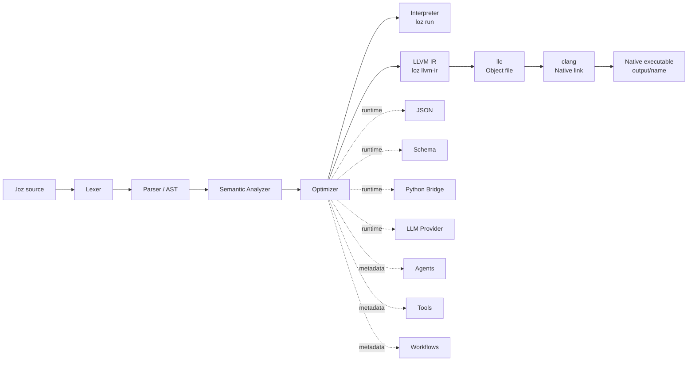

# Loz

<div align="center">

# 🇪🇬 Loz

### The first Egyptian programming language built for AI Agents, Automation, Workflows, and Native Execution.

**Loz** is a compiled-first, agent-aware programming language that combines readable source files, practical automation primitives, Python interoperability, LLM runtime configuration, and an LLVM-based native build path.

Loz is still **Alpha** and experimental, but its direction is clear: make AI-agent programs explicit, checkable, tool-oriented, workflow-aware, and capable of becoming native executables.

<br/>


</div>

---

## 🚦 Project Status

| Track | Current status |
| --- | --- |
| Release | `v0.1.0-alpha` / Alpha |
| Stability | Experimental |
| Syntax compatibility | Not guaranteed yet |
| Native executable coverage | Linux-first; cross-platform hardening in progress |
| Windows native build | Limited / being hardened |
| Editor support | VS Code extension included in `vscode-loz/` |
| CI | GitHub Actions configured |
| Public readiness | Early reference implementation |

> Loz is not production-hardened yet. It is an experimental language toolchain and research-style engineering project designed to evolve quickly.

---

## 🧠 What Loz Is

Loz is a Rust-based language toolchain with a practical compiler pipeline:

- **Lexer** for tokenizing `.loz` source files.
- **Parser** for building the AST.
- **Semantic checker** for validating types, declarations, imports, tools, agents, and workflows.
- **Optimizer** for simple compile-time simplification.
- **Interpreter** for fast `loz run` execution.
- **LLVM IR generator** for native output.
- **Runtime library** for JSON, schema, Python, and LLM-oriented operations.
- **CLI** for checking, running, building, initializing, diagnosing, and inspecting projects.

Loz is designed around automation-first programs: source files should be explicit, inspectable, and suitable for tooling.

---

## 🇪🇬 Why Loz Exists

AI agents are often built as loose prompt chains, scripts, and hidden runtime glue. That makes them difficult to inspect, test, package, and compile.

Loz explores a different direction:

| Problem | Loz direction |
| --- | --- |
| Prompt-only workflows are fragile | Make tools, schemas, tasks, and workflows explicit |
| Automation code becomes scattered | Keep automation logic inside readable `.loz` source files |
| Scripting is flexible but hard to compile | Keep an interpreter path and an LLVM native path |
| AI tooling depends heavily on Python | Support Python interoperability through `python.call(...)` |
| Local LLM workflows need privacy | Support environment-driven local providers such as Ollama |
| Agent systems need structure | Treat agents, tasks, tools, and workflows as language-level project concepts |

**Loz is Egyptian-built and agent-oriented by identity.** The goal is not to replace every language. The goal is to explore what a programming language for AI agents and automation should look like when it is explicit, checkable, native-capable, and developer-friendly.

---

## ✨ Why Loz Is Different

| Icon | Idea | What Loz does |
| --- | --- | --- |
| 🤖 | AI-agent aware | Agents and tasks are first-class project concepts |
| 🧩 | Tool-oriented | Tools can be declared, called, and wired into automation logic |
| 🔁 | Workflow-aware | Workflow steps are explicit and runnable from the CLI |
| 📄 | JSON-ready | Runtime helpers support parsing, stringifying, and reading JSON |
| 🧬 | Schema-aware | Schema validation and requirement checks are part of the runtime direction |
| 🐍 | Python-friendly | `python.call(...)` bridges Loz programs to Python functions |
| ⚡ | Native path | Loz can emit LLVM IR, lower with `llc`, and link with `clang` |
| 📦 | Project-based | `loz.toml`, `.env`, and path dependencies support project workflows |
| 🖥 | Editor-ready | VS Code syntax, snippets, commands, and `.loz` file association are included |

---

## 🧱 Architecture



The pipeline is intentionally visible. Loz should be understandable as a language and as a toolchain.

---

## 🧰 Technology Stack

| Technology | Role in Loz |
| --- | --- |
| 🦀 Rust | Main implementation language for the compiler, runtime, and CLI |
| ⚡ LLVM | Intermediate representation and native code generation path |
| 🛠 `llc` | Lowers LLVM IR to object files |
| 🔗 `clang` | Links native executables |
| 🐍 Python | Interop target for practical tool functions |
| 📄 JSON | Data exchange format for tools, Python calls, and runtime helpers |
| 🧠 Ollama | Local LLM provider target for private/offline model workflows |
| 🖥 VS Code | Editor integration, syntax highlighting, snippets, and commands |
| 🧪 GitHub Actions | CI checks for formatting, tests, and project validation |

---

## ✨ Current Capabilities

### Language Core

| Feature | Status |
| --- | --- |
| Functions and return values | Supported |
| Variables and mutability | Supported |
| Numeric operations | Supported |
| `if` / `else` | Supported |
| `while` loops | Supported |
| Struct declarations and usage | Supported |
| Arrays | Supported |
| Maps / sets | Supported in interpreter paths; LLVM support may be limited |
| References | Supported |
| Async / await | MVP sequential support |
| Top-level agent / workflow metadata | Supported |

### Compiler and Runtime

| Area | Support |
| --- | --- |
| Lexing / parsing | Implemented |
| Semantic analysis | Implemented |
| Diagnostics | Implemented and improving |
| Optimizer | Implemented for basic constant folding / simplification |
| Interpreter | `loz run` |
| LLVM IR | `loz llvm-ir` |
| Native build | `loz build` |
| Runtime library | JSON, schema, Python bridge, LLM-oriented runtime pieces |

### Tooling

| Tooling | Support |
| --- | --- |
| CLI | `check`, `run`, `llvm-ir`, `build`, `init`, `doctor`, `deps`, `agent`, `workflow` |
| Project mode | `loz.toml` and project root detection |
| Local packages | Path dependencies |
| Editor support | VS Code extension in `vscode-loz/` |
| CI | GitHub Actions workflow |

---

## 🚀 Quick Start

### Prerequisites

Install:

- Rust toolchain with Cargo
- `clang`
- `llc`
- LLVM toolchain
- On Ubuntu/Linux native builds: `build-essential`, `clang`, `gcc`, `g++`, `libc6-dev`, `pkg-config`, `llvm`

### Build the workspace

```bash
cargo build --workspace
./target/debug/loz --version
```

### Check, run, and build the first program

```bash
./target/debug/loz check examples/hello.loz
./target/debug/loz run examples/hello.loz
./target/debug/loz build examples/hello.loz
./output/hello
```

Expected output:

```text
Hello from Loz
```

---

## 👋 First Loz Program

```loz
func main() -> i32 {
    print("Hello from Loz");
    return 0;
}
```

Run it through the interpreter:

```bash
./target/debug/loz run examples/hello.loz
```

Build a native executable:

```bash
./target/debug/loz build examples/hello.loz
./output/hello
```

---

## 🤖 AI Agents, Tools, and Workflows

Loz is designed to make automation concepts explicit.

Instead of hiding an agent behind unstructured runtime code, Loz can model agent-oriented programs as source-level declarations and CLI-runnable units.

### Agent direction

Loz supports agent/task metadata and CLI operations such as:

```bash
./target/debug/loz agent list examples/agent_support.loz
LOZ_LLM_PROVIDER=mock ./target/debug/loz agent run examples/agent_support.loz "hello"
```

Mock output:

```text
[mock] hello
```

Agent support is still evolving, but the intended structure is clear:

- **Agent**: describes an agent unit.
- **Task**: describes a callable agent action.
- **Tool**: exposes reusable project logic.
- **Workflow**: sequences project steps.
- **LLM runtime**: routes LLM calls through environment-driven providers.

### Workflow direction

Loz workflow commands:

```bash
./target/debug/loz workflow list examples/workflow_onboarding.loz
./target/debug/loz workflow run examples/workflow_onboarding.loz
```

A workflow is meant to represent explicit automation steps rather than hidden script glue.

---

## 🧩 Tools, JSON, and Schemas

Loz includes runtime-oriented building blocks for structured automation.

| Area | Purpose |
| --- | --- |
| Tools | Represent reusable callable logic |
| JSON helpers | Parse, stringify, and read structured data |
| Schemas | Validate required data shape |
| Agent tasks | Use structured logic in LLM-oriented flows |
| Workflows | Run ordered steps from the CLI |

These features are especially important for AI-agent systems, because reliable agents need structured inputs and predictable outputs.

---

## 🐍 Python Interop

Python interoperability gives Loz access to the existing AI and automation ecosystem.

Conceptually:

```loz
const result: Json = python.call("tools.analyze_text", payload);
```

Python side:

```python
def analyze_text(payload):
    text = payload["text"]
    return {
        "length": len(text),
        "label": "ok",
    }
```

The current direction:

- Loz sends a JSON-like payload.
- Python receives a dictionary-like object.
- Python returns a JSON-serializable object.
- Project-root Python tools can be used for practical automation.
- `LOZ_PYTHON_PATH` can configure the Python executable path where supported.

This keeps Loz focused while still allowing access to Python libraries.

---

## 🧠 LLM Runtime: Mock, Ollama, and Local Agent Execution

Loz supports LLM-oriented execution through runtime configuration.

### Mock provider

Useful for tests, examples, and deterministic demos:

```bash
LOZ_LLM_PROVIDER=mock ./target/debug/loz run examples/llm_mock.loz
```

Optional mock response:

```bash
LOZ_LLM_MOCK_RESPONSE="A controlled test response"
```

### Ollama provider

Ollama support is designed for local model workflows.

Example configuration:

```bash
export LOZ_LLM_PROVIDER=ollama
export LOZ_LLM_BASE_URL=http://127.0.0.1:11434
export LOZ_LLM_MODEL=llama3.2
```

Then run:

```bash
./target/debug/loz run examples/llm_ollama.loz
```

Notes:

- Ollama must be installed and running separately.
- Loz does not bundle model weights.
- Local model performance depends on the user machine and selected model.

### GitHub token / provider direction

Where GitHub-backed LLM access is configured, token handling should be done through environment variables such as:

```bash
export LOZ_GITHUB_TOKEN=...
```

If the token variable name is configurable, `LOZ_GITHUB_TOKEN_ENV` can be used to point Loz to the desired environment variable name.

> Keep secrets out of source files and `.env` files committed to Git.

---

## 📦 Project Mode: `loz.toml`, `.env`, and Local Packages

Loz supports project-aware workflows.

A project can contain:

```text
my-agent/
├── loz.toml
├── .env.example
├── src/
│   └── main.loz
└── tools/
    └── tools.py
```

Example `loz.toml`:

```toml
[project]
name = "my-agent"
main = "src/main.loz"

[llm]
provider = "mock"
model = "mock"

[python]
path = "python3"

[dependencies]
text_utils = { path = "./packages/text_utils" }
```

Project behavior:

- Commands can infer the source file from `[project].main`.
- `.env` can provide local runtime configuration.
- Path dependencies allow local package-style development.
- Project root detection makes tools and Python modules easier to resolve.

---

## 🛠 CLI Reference

| Command | Purpose | Example |
| --- | --- | --- |
| `loz check [source.loz]` | Parse and semantically validate a program | `./target/debug/loz check examples/hello.loz` |
| `loz run [source.loz]` | Execute through the interpreter | `./target/debug/loz run examples/hello.loz` |
| `loz llvm-ir [source.loz]` | Print LLVM IR to stdout | `./target/debug/loz llvm-ir examples/hello.loz` |
| `loz build [source.loz]` | Produce native executable and `.ll` output | `./target/debug/loz build examples/hello.loz` |
| `loz deps` | Show local path dependencies | `cd examples/package_demo && ../../target/debug/loz deps` |
| `loz doctor` | Inspect toolchain and runtime readiness | `./target/debug/loz doctor` |
| `loz init <project-name>` | Scaffold a project | `./target/debug/loz init sample-app` |
| `loz agent list [source.loz]` | List agents in a source file | `./target/debug/loz agent list examples/agent_support.loz` |
| `loz agent run ...` | Run an agent task | `LOZ_LLM_PROVIDER=mock ./target/debug/loz agent run examples/agent_support.loz "hello"` |
| `loz workflow list [source.loz]` | List workflows | `./target/debug/loz workflow list examples/workflow_onboarding.loz` |
| `loz workflow run ...` | Run a workflow | `./target/debug/loz workflow run examples/workflow_onboarding.loz` |

More details live in [docs/cli.md](docs/cli.md).

---

## ⚙️ Native Build

Loz can compile a checked program to LLVM IR, lower it to an object file with `llc`, and link a native executable with `clang`.

```bash
./target/debug/loz build examples/arithmetic.loz
./output/arithmetic
```

Expected output:

```text
30
```

Generated artifacts:

| Artifact | Location |
| --- | --- |
| Native executable | `output/<program-name>` |
| LLVM IR snapshot | `output/<program-name>.ll` |

Native build path:


Current native confidence is **Linux-first**. Windows and macOS native behavior is being hardened gradually.

---

## 🖥 VS Code Extension

Loz includes VS Code support under:

```text
vscode-loz/
```

Current editor direction:

- `.loz` language association
- syntax highlighting
- snippets
- command palette actions
- `.loz` file icons through a file icon theme
- `loz.toml` association with TOML

Typical commands:

- `Loz: Check Current File`
- `Loz: Run Current File`
- `Loz: Build Current File`
- `Loz: Generate LLVM IR`
- `Loz: Agent List`
- `Loz: Workflow List`

Marketplace publishing is a release-preparation task.

---

## 🧪 Testing and Validation

Core validation commands:

```bash
cargo fmt
cargo check --workspace
cargo test --workspace
cargo build --workspace
./scripts/test_native_examples.sh
```

Native examples currently include:

- `examples/hello.loz`
- `examples/arithmetic.loz`
- `examples/variables.loz`
- `examples/if_else.loz`
- `examples/while_loop.loz`
- `examples/functions.loz`

---

## 🔁 GitHub Actions / CI

Loz uses GitHub Actions for continuous validation.

Typical CI coverage includes:

- formatting checks
- Rust tests
- workspace build checks
- VS Code extension JSON checks
- basic Windows crate coverage where full LLVM/codegen support is still being stabilized
- Linux-first native build checks where enabled

CI is part of the release-hardening process, not a claim that every platform is fully production-ready.

---

## 📚 Documentation

| Document | Purpose |
| --- | --- |
| [RELEASE_NOTES.md](RELEASE_NOTES.md) | Draft release notes for `v0.1.0-alpha` |
| [docs/getting-started.md](docs/getting-started.md) | First-time setup, build, run, native output |
| [docs/language-syntax.md](docs/language-syntax.md) | Beginner-friendly syntax guide |
| [docs/cli.md](docs/cli.md) | CLI commands and usage |
| [docs/native-build.md](docs/native-build.md) | Native build workflow and troubleshooting |
| [docs/project-structure.md](docs/project-structure.md) | Repo layout and crate responsibilities |
| [docs/limitations.md](docs/limitations.md) | Alpha-stage limitations |
| [docs/language-reference.md](docs/language-reference.md) | Language reference |
| [docs/compiler-architecture.md](docs/compiler-architecture.md) | Compiler overview |

---

## 🗂 Project Structure

```text
.
├── crates/
│   ├── loz_ast          # Core AST definitions
│   ├── loz_cli          # CLI, project mode, native build commands
│   ├── loz_codegen      # Interpreter and LLVM code generation
│   ├── loz_lexer        # Tokenizer
│   ├── loz_optimizer    # Basic optimizer
│   ├── loz_parser       # Parser
│   ├── loz_runtime      # Runtime FFI and helpers
│   └── loz_semantic     # Type checking and semantic validation
├── docs/
├── examples/
├── scripts/
├── vscode-loz/
└── .github/workflows/
```

---

## ⚠️ Current Limitations

Loz is intentionally honest about its current state:

- Alpha and experimental.
- Syntax may change.
- Not production-stable.
- Native build confidence is Linux-first.
- Windows LLVM/codegen behavior is still being hardened.
- Package management is currently local-path oriented.
- LSP/editor tooling is not complete unless explicitly added later.
- Runtime permissions and sandboxing are not finalized.
- Agent/workflow runtime behavior is evolving.

---

## 🗺 Roadmap

### Near-term Alpha priorities

- Stabilize the CLI.
- Harden GitHub Actions.
- Improve native build reliability.
- Publish release binaries.
- Prepare npm installer path.
- Package and publish VS Code extension.
- Keep docs and examples aligned with real behavior.

### Mid-term goals

- Stronger package workflows.
- LSP support.
- More capable agents and workflows.
- HTTP / filesystem standard library direction.
- Permissions and sandboxing design.
- Better Windows and macOS native build confidence.

### Long-term vision

- Agent ecosystem.
- Package registry.
- Cloud/local runtime targets.
- Advanced workflow engine.
- AI-native developer tooling.
- Strong compatibility guarantees after Alpha.

---

## 🤝 Contribution Notes

If you are contributing to Loz:

1. Keep docs aligned with actual implementation behavior.
2. Run validation before opening a change.
3. Treat undocumented syntax as a bug, not a feature to imply.
4. Keep Alpha limitations visible.
5. Prefer small, testable changes.

---

## 📄 License

Loz is released under the [MIT License](LICENSE).

---

<div align="center">

**Loz is early. Loz is experimental. Loz is Egyptian-built.**

A programming language for AI agents and automation should be explicit, inspectable, native-capable, and developer-friendly.

</div>
