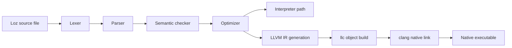

# Loz

> A compiled-first, agent-aware programming language for workflows, tools, and native builds.

`Alpha` `Experimental` `Syntax may change` `Native build: Linux-first`

Loz is an early-stage programming language project focused on practical automation: parseable source files, semantic checking, interpreter execution, LLVM IR generation, and native executable output. It also includes higher-level building blocks for tools, JSON/schema validation, Python interop, agents, and workflows.

## 🚦 Status

| Track | Current state |
| --- | --- |
| Release maturity | Alpha |
| Stability | Experimental |
| Syntax compatibility | Not guaranteed yet |
| Native executable coverage | Linux-first |
| VS Code support | Included in `vscode-loz/` |

## 🧠 What Loz Is

Loz is a Rust-based language toolchain with:

- A lexer, parser, semantic checker, optimizer, code generator, runtime, and CLI.
- An interpreter path for quick execution with `loz run`.
- An LLVM-based native build path with `loz build`.
- Built-in support for practical automation concepts such as tools, workflows, JSON, schemas, and LLM-oriented tasks.

## Why Loz Exists

- To explore a language designed for automation-first programs instead of general application frameworks.
- To make source files readable and explicit while still supporting native builds.
- To provide a clear pipeline from source code to semantic validation, interpreter execution, LLVM IR, and native binaries.
- To keep the project approachable for experimentation during its Alpha stage.

## ✨ Current Capabilities

| Area | Current support |
| --- | --- |
| Core syntax | Functions, return values, variables, mutability, arithmetic, `if` / `else`, `while` |
| Execution | `loz run` interpreter path |
| Native build | `loz build` produces an executable and `.ll` file |
| IR inspection | `loz llvm-ir` prints LLVM IR to stdout |
| Diagnostics | Semantic diagnostics plus `loz doctor` environment checks |
| Automation features | Tools, JSON helpers, schemas, workflows, agents |
| Project scaffolding | `loz init` creates a starter project |
| Local packages | Path-based package dependencies via `loz.toml` |
| Editor support | VS Code extension with `.loz` association |

## 🚀 Quick Start

### Prerequisites

- Rust toolchain with Cargo
- `clang`
- `llc`
- On Ubuntu/Linux native builds: `build-essential`, `clang`, `gcc`, `g++`, `libc6-dev`, `pkg-config`, `llvm`

### Build the workspace

```bash
cargo build --workspace
./target/debug/loz --version
```

### Check, run, and build the first example

```bash
./target/debug/loz check examples/hello.loz
./target/debug/loz run examples/hello.loz
./target/debug/loz build examples/hello.loz
./output/hello
```

Expected output:

```text
Hello from Loz
```

## 👋 First Loz Program

```loz
func main() -> i32 {
    print("Hello from Loz");
    return 0;
}
```

Interpreter run:

```bash
./target/debug/loz run examples/hello.loz
```

Native build:

```bash
./target/debug/loz build examples/hello.loz
./output/hello
```

## 🛠 CLI Overview

| Command | Purpose | Example |
| --- | --- | --- |
| `loz check [source.loz]` | Parse and semantically validate a program | `./target/debug/loz check examples/hello.loz` |
| `loz run [source.loz]` | Execute a program in interpreter mode | `./target/debug/loz run examples/hello.loz` |
| `loz llvm-ir [source.loz]` | Print LLVM IR to stdout | `./target/debug/loz llvm-ir examples/hello.loz` |
| `loz build [source.loz]` | Produce a native executable plus `.ll` output | `./target/debug/loz build examples/hello.loz` |
| `loz deps` | Show local path dependencies in the current project | `cd examples/package_demo && ../../target/debug/loz deps` |
| `loz doctor` | Inspect toolchain and runtime readiness | `./target/debug/loz doctor` |
| `loz init <project-name>` | Scaffold a new Loz project | `./target/debug/loz init sample-app` |
| `loz agent list [source.loz]` | List agents defined in a source file | `./target/debug/loz agent list examples/agent_support.loz` |
| `loz agent run [source.loz] [Agent] [Task] [args...]` | Run an agent task | `LOZ_LLM_PROVIDER=mock ./target/debug/loz agent run examples/agent_support.loz "hello"` |
| `loz workflow list [source.loz]` | List workflows in a source file | `./target/debug/loz workflow list examples/workflow_onboarding.loz` |
| `loz workflow run [source.loz] [WorkflowName]` | Run a workflow | `./target/debug/loz workflow run examples/workflow_onboarding.loz` |

More detail lives in [docs/cli.md](docs/cli.md).

## ⚙️ Native Build

Loz can compile a checked program to LLVM IR, lower it to an object file with `llc`, and link a native executable with `clang`.

```bash
./target/debug/loz build examples/arithmetic.loz
./output/arithmetic
```

Expected output:

```text
30
```

Generated artifacts:

| Artifact | Location |
| --- | --- |
| Native executable | `output/<program-name>` |
| LLVM IR snapshot | `output/<program-name>.ll` |

## 🧭 Architecture



## 📚 Documentation

| Document | Purpose |
| --- | --- |
| [RELEASE_NOTES.md](RELEASE_NOTES.md) | Draft release notes for `v0.1.0-alpha` |
| [docs/getting-started.md](docs/getting-started.md) | First-time setup, build, run, native output |
| [docs/language-syntax.md](docs/language-syntax.md) | Beginner-friendly syntax guide based on real examples |
| [docs/cli.md](docs/cli.md) | Actual CLI commands and usage patterns |
| [docs/native-build.md](docs/native-build.md) | Native build workflow, prerequisites, troubleshooting |
| [docs/project-structure.md](docs/project-structure.md) | Repo layout and crate responsibilities |
| [docs/limitations.md](docs/limitations.md) | Honest Alpha-stage boundaries |
| [docs/language-reference.md](docs/language-reference.md) | Broader reference for advanced language areas |
| [docs/compiler-architecture.md](docs/compiler-architecture.md) | Compiler overview and implementation notes |

## 🗂 Project Structure

```text
.
├── crates/
│   ├── loz_ast
│   ├── loz_cli
│   ├── loz_codegen
│   ├── loz_lexer
│   ├── loz_optimizer
│   ├── loz_parser
│   ├── loz_runtime
│   └── loz_semantic
├── docs/
├── examples/
├── scripts/
├── vscode-loz/
└── .github/workflows/
```

See [docs/project-structure.md](docs/project-structure.md) for the detailed breakdown.

## 🧪 Testing And Validation

Core validation commands used in this repo:

```bash
cargo fmt
cargo check --workspace
cargo test --workspace
cargo build --workspace
./scripts/test_native_examples.sh
```

The native examples script currently validates:

- `examples/hello.loz`
- `examples/arithmetic.loz`
- `examples/variables.loz`
- `examples/if_else.loz`
- `examples/while_loop.loz`
- `examples/functions.loz`

## ⚠️ Current Limitations

- Loz is still Alpha and experimental.
- Syntax may change between releases.
- Native build validation is Linux-first.
- The standard library and packaging story are still minimal.
- Advanced runtime-oriented features should be treated as evolving rather than hardened.

See [docs/limitations.md](docs/limitations.md) for the full list.

## 🗺 Roadmap

Near-term Alpha priorities:

- Strengthen documentation and onboarding
- Expand native example coverage
- Keep CLI behavior stable and well-documented
- Improve editor experience for `.loz` files
- Continue hardening native builds and public release polish

Longer-term goals:

- More polished package workflows
- Better cross-platform native build confidence
- Stronger compatibility guarantees after Alpha

## 🤝 Contribution Notes

If you are contributing to Loz:

1. Keep docs aligned with actual implementation behavior.
2. Run the validation commands before opening a change.
3. Treat undocumented syntax or unsupported behavior as a bug, not a feature to imply in docs.

## 📄 License

Loz is released under the [MIT License](LICENSE).
