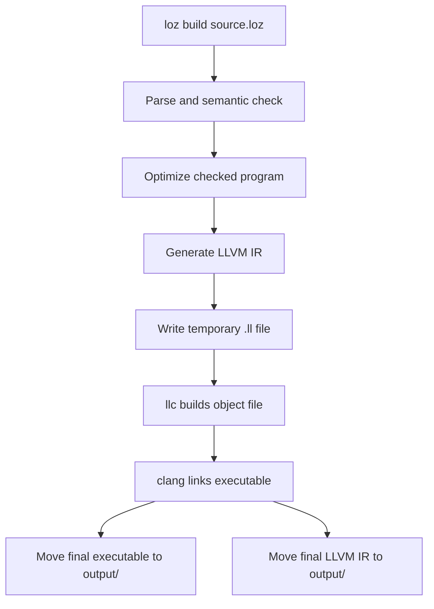

# ⚙️ Native Build In Loz

This guide explains what Loz native build means today, how it works at a high level, and what you need to make it succeed on a Linux-first setup.

## What Native Build Means

`loz build` takes a checked Loz program and produces:

- a native executable in `output/`
- a saved LLVM IR file in `output/`

Example:

```bash
./target/debug/loz build examples/hello.loz
./output/hello
```

## Current Status

- Native build is available now.
- Validation is currently Linux-first.
- The repo includes an automated native examples script for core behavior coverage.

## Required Tools

### Core toolchain

- `cargo`
- `clang`
- `llc`

### Ubuntu/Linux native link packages

```bash
sudo apt-get update
sudo apt-get install -y build-essential clang gcc g++ libc6-dev pkg-config llvm
```

These packages matter because Loz ultimately relies on the system linker environment to produce a final executable.

## Build Flow



## Command Example

```bash
./target/debug/loz build examples/arithmetic.loz
./output/arithmetic
```

Expected stdout:

```text
30
```

## Output Folder Behavior

After a successful native build, Loz writes final artifacts under `output/`.

| Artifact | Example |
| --- | --- |
| Executable | `output/hello` |
| LLVM IR snapshot | `output/hello.ll` |

The repo’s native example validation depends on those output names.

## Native Examples Script

The repository includes:

```bash
./scripts/test_native_examples.sh
```

It currently:

1. Builds the workspace
2. Builds each supported native example with `./target/debug/loz build`
3. Runs the produced binary from `./output/`
4. Verifies exact stdout for each example

Current covered examples:

- `hello`
- `arithmetic`
- `variables`
- `if_else`
- `while_loop`
- `functions`

## Linux-First Practical Notes

For current Alpha usage, Linux is the reference environment for native output. That does not mean other platforms are impossible; it means the strongest verified path is Linux.

## Common Errors And Fixes

### `clang: command not found`

Install the LLVM/native toolchain:

```bash
sudo apt-get update
sudo apt-get install -y clang llvm
```

### `llc: command not found`

Install LLVM tooling:

```bash
sudo apt-get update
sudo apt-get install -y llvm
```

### Clang cannot find libc or fails during final link

Install the Linux native development toolchain:

```bash
sudo apt-get update
sudo apt-get install -y build-essential clang gcc g++ libc6-dev pkg-config llvm
```

If the linker cannot find the system C runtime, `libc6-dev` or the broader build toolchain is usually incomplete or missing.

### `loz check` passes but `loz build` fails

That usually means the front-end and interpreter path are fine, but the native toolchain is incomplete.

### Native executable not produced in `output/`

If the final executable is missing:

- read the full error from `loz build`
- check that `clang` and `llc` exist
- confirm the system linker toolchain is installed

## Recommended Validation Sequence

```bash
cargo build --workspace
./target/debug/loz --version
./target/debug/loz build examples/hello.loz
./output/hello
./scripts/test_native_examples.sh
```
