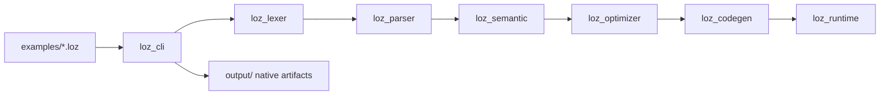

# 🗂 Loz Project Structure

This guide explains the current Loz repository layout and what each major directory is responsible for.

## Top-Level Overview

```text
.
├── crates/
├── docs/
├── examples/
├── scripts/
├── vscode-loz/
└── .github/workflows/
```

## `crates/`

The Rust workspace is split into focused crates.

| Path | Role |
| --- | --- |
| `crates/loz_lexer` | Tokenizes Loz source text |
| `crates/loz_parser` | Parses tokens into AST structures |
| `crates/loz_ast` | Defines shared abstract syntax tree types |
| `crates/loz_semantic` | Runs semantic analysis and validation |
| `crates/loz_optimizer` | Applies optimization passes to checked programs |
| `crates/loz_codegen` | Handles interpreter execution and LLVM IR generation |
| `crates/loz_runtime` | Provides runtime support used by generated/native programs |
| `crates/loz_cli` | Implements the `loz` command-line interface |

## `docs/`

User-facing and project-facing documentation.

Examples:

- onboarding guides
- syntax documentation
- CLI documentation
- architecture notes
- limitations and roadmap material

## `examples/`

Runnable Loz source files and sample projects.

Current basic native examples:

- `hello.loz`
- `arithmetic.loz`
- `variables.loz`
- `if_else.loz`
- `while_loop.loz`
- `functions.loz`

Additional examples cover:

- agents
- workflows
- JSON/schema flows
- async tasks
- package demos
- Python tool integration

## `scripts/`

Repository helper scripts.

Current script:

- `scripts/test_native_examples.sh`

This script builds and validates the native example set by checking exact stdout from each generated executable.

## `vscode-loz/`

The VS Code extension for Loz.

It currently contains:

- `package.json` for extension metadata and language contribution
- `language-configuration.json` for editor behavior
- `syntaxes/loz.tmLanguage.json` for TextMate syntax highlighting
- `snippets/` for Loz snippets
- `src/extension.js` for lightweight commands

## `.github/workflows/`

GitHub Actions workflow definitions for repository validation.

Current CI responsibilities include:

- formatting checks
- Rust test/build validation
- Linux-native example validation
- VS Code extension JSON/JS validation

## Other Important Paths

| Path | Purpose |
| --- | --- |
| `Cargo.toml` | Rust workspace definition |
| `Cargo.lock` | Rust dependency lockfile |
| `runtime/` | Runtime-related support files |
| `tests/` | Additional repository tests/support code |
| `output/` | Generated native build artifacts during local runs |
| `target/` | Cargo build output |

## How The Pieces Fit Together



## Practical Reading Order

If you are new to the repo, this order works well:

1. `README.md`
2. `docs/getting-started.md`
3. `examples/`
4. `docs/language-syntax.md`
5. `crates/loz_cli`
6. The rest of the compiler crates in pipeline order
